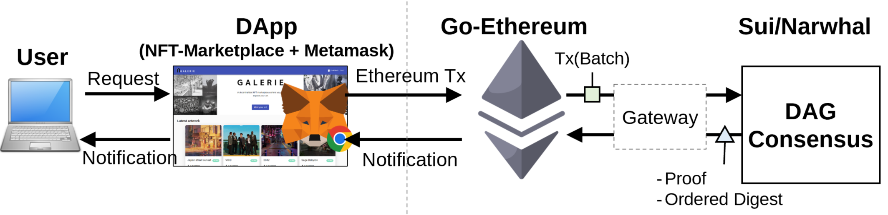

# solidity-narwhal
A simple demonstration of executing Solidity smart contracts in a metamask-enanbled NFT marketplace, using the sui/narwhal as a consensus engine. Ideal for understanding interactions between dapp, contract, geth, and narwhal. 

- [go-ethereum](https://github.com/ethereum/go-ethereum): An Ethereum client for executing Solidity contracts on EVM, communicating with the gateway and end users. 
- [sui](https://github.com/MystenLabs/sui/tree/main/narwhal): A narwhal consensus algorithm developed by MystenLabs 
- [NFT-Marketplace](https://github.com/BravoNatalie/NFT-Marketplace): An example matamask-enabled DApp 
- gateway: An interface between go-ethereum and narwhal 
- eth-poa-devnet: Network miscellaneous for private ethereum network

## Flow

## Video 
[Demo Video](https://youtu.be/GzcjNMDDeUE)

## Notes
Originally, this work started as a small side project, taking into consideration the potential to offer high-performance Ethereum solidity smart contract execution through a DAG-based Consensus that enables high throughput. The work is still in progress as in a [technical paper](./technical-paper.pdf) for improvements beyond this simple demo.

 

